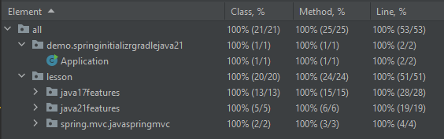

## Lessons Review

- 01 Review sprint initialize gradle java 21
    - spring initializer - https://start.spring.io/
- 02 Review lesson java 17 since java 8
    - Language enhancements
        - A - Records ✅
        - B - Switch expressions ✅
        - C - Pattern matching for `instanceof` ✅
        - D - Text blocks ✅
        - E - Local variable type inference for lambda expressions ✅
    - Other key features
        - F - Sealed classes and interfaces ✅
        - G - Improved deserialization ❌ canceled
        - H - Flexible `main` method ❌ canceled
        - I - Enhanced random number generation ✅
        - J - Foreign Function and Memory API (incubator) ⛔ excluded by c language relates
- 03 Review lesson java 21 since java 17
    - Major additions
        - A - Virtual threads ✅
        - B - Structured concurrency ⛔ require --enable-preview
        - C - Scoped values ⛔ require --enable-preview
        - D - Sequenced collections ⚠️ internal improvement
        - E - Key encapsulation mechanism API ⛔ require --enable-preview
    - Additional notable changes
        - F - Switch expressions type ✅
        - G - String templates ⛔ require --enable-preview
        - H - Elastic metaspace ⚠️ internal improvement
        - I - Foreign-Memory Access API ⛔ require --enable-preview
        - J - Enable dynamic archiving of classes ⛔ require --enable-preview
        - K - Improved class loading ⚠️ internal improvement
        - L - Pattern matching for `instanceof` ✅
- 04 Review lesson spring 
  - Java spring mvc
- 05 Review legacy lessons
  - Java
    - https://github.com/MrParkerZ7/lesson-first-java
    - https://github.com/MrParkerZ7/fork-demo-java-spring-cloud-function-webflux
    - https://github.com/MrParkerZ7/sample-java-spring-boot-connect-mssql
    - https://github.com/MrParkerZ7/sample-java-spring-web-jpa-mysql-flyway
    - https://github.com/MrParkerZ7/sample-java-spring-sleuth-client
    - https://github.com/MrParkerZ7/sample-java-spring-sleuth-server
    - https://github.com/MrParkerZ7/mono-lessons-java-spring-security
    - https://github.com/MrParkerZ7/mono-lessons-java-spring-application-testing-master
    - https://github.com/MrParkerZ7/lesson-java-spring-mongodb-2step
    - https://github.com/MrParkerZ7/lesson-java-spring-reactive-mongodb-2step
    - https://github.com/MrParkerZ7/mono-lessons-java-spring-cloud-eureka
    - https://github.com/MrParkerZ7/mono-lessons-java-spring-mongo-master
    - https://github.com/MrParkerZ7/mono-lessons-java-spring-backend-service-full-system
    - https://github.com/MrParkerZ7/fork-sample-kotlin-gradle-dsl-mono-repository-spring-boot
  - Kotlin
    - https://github.com/MrParkerZ7/kotlin2step
    - https://github.com/MrParkerZ7/demo-kotlin-test
    - https://github.com/MrParkerZ7/sample-node-engine-on-kotlin
    - https://github.com/MrParkerZ7/sample-docker-kotlin-spring-web-actuator
    - https://github.com/MrParkerZ7/demo-lambda-function-kotlin-spring-cloud-mvn
    - https://github.com/MrParkerZ7/mono-lessons-kotlin-spring-eureka-master
    - https://github.com/MrParkerZ7/mono-lessons-kotlin-spring-mongo-master
    - https://github.com/MrParkerZ7/mono-lessons-kotlin-spring-security-master
    - https://github.com/MrParkerZ7/sample-kotlin-gradle-dsl-mono-repository
  - Java/Kotlin
    - https://github.com/MrParkerZ7/mono-sample-java-kotlin-spring-jackson
- 06 Attachment
  - [postman test for 04 spring-mvc](04-java-spring-mvc/postman_collection/java-spring-mvc-postman.postman_collection.json)
  - 
